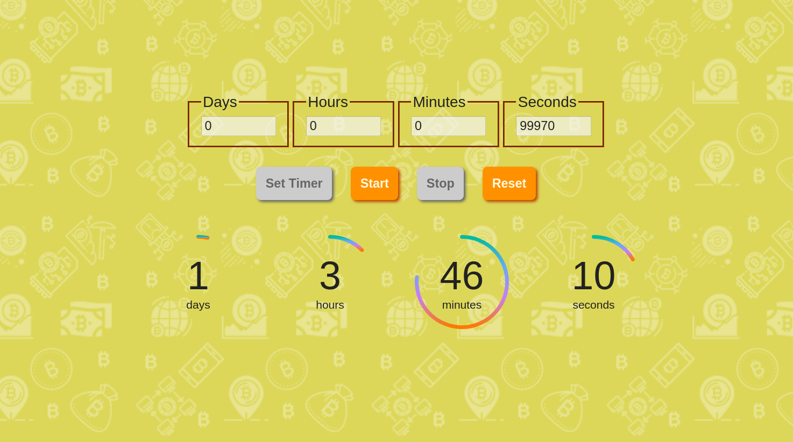

# Countdown - Bitcoin

> In this repository, a time counter is being developed which, at the end of the time chosen by the user, shows the difference between the initial and final value of the Bitcoin currency. The objective of this project is to establish the knowledge acquired in React and others necessary for its realization. Author: _[Flávio Bianchetti](https://www.linkedin.com/in/flaviobianchetti/)_ :rocket: (2021).

> Were used in this app:

<section style="display: inline-block;">
  
  
  
  
  
</section>

> Below is a screenshot of the countdown app developed so far.

> You can test the app at this _[link](http://countdown-bitcoin.surge.sh/)_.

# Versão em português - Contagem Regressiva - Bitcoin

> Neste repositório está sendo desenvolvido um contador de tempo que, ao término do tempo escolhido pelo usuário, mostra a diferença entre o valor inicial e final da moeda Bitcoin. O propósito deste projeto é fixar os conhecimentos adquiridos em React e outros necessários para a sua conclusão. Autor: _[Flávio Bianchetti](https://www.linkedin.com/in/flaviobianchetti/)_ :rocket: (2021).

> Acima, na versão em inglês, é exibida uma captura de tela do aplicativo de contagem regressiva, desenvolvido até agora.

> Foram usados ​​neste aplicativo:

<section style="display: inline-block;">
  
  
  
  
  
</section>

> Você pode testar o aplicativo neste _[link](http://countdown-bitcoin.surge.sh/)_.